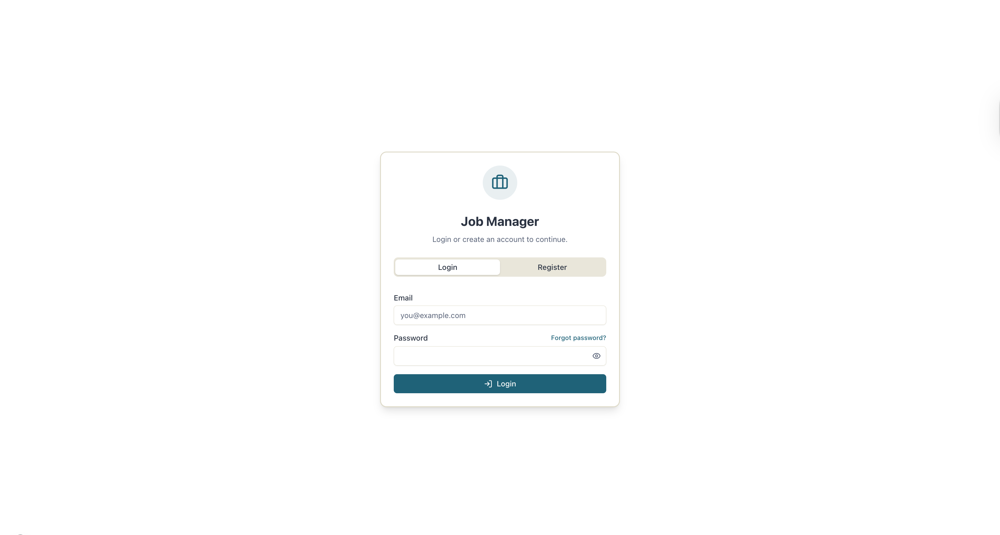

# Upwork Job Manager Dashboard

A professional dashboard designed to help freelancers manage multiple Upwork accounts, track job proposals, and monitor client replies efficiently. This full-stack application features a **Next.js** frontend and a **NestJS** backend with **MySQL** database.



## 🚀 Key Features

*   **Secure Authentication**:
    *   Full Email/Password registration and login flow.
    *   **JWT Authentication**: Secure API access using JSON Web Tokens.
    *   **Session Management**: Persistent user sessions.
*   **Multi-Account Management**:
    *   Add and manage multiple freelancer profiles/accounts.
    *   Visual "Your Accounts" selector with scrollable support for many accounts.
    *   Duplicate email validation to ensure data integrity.
*   **Comprehensive Job Tracking**:
    *   Track **Client Details** (Name, Country, Rating).
    *   Monitor **Payment Verification Status** (Verified, Pending, Unverified).
    *   Store **Proposal Content** and job descriptions.
    *   **File Attachments**: Upload and preview PDFs and images directly within the dashboard.
*   **Reply Management**:
    *   Dedicated status for jobs with client replies.
    *   Track reply dates and messages.
    *   Filter views between "All Jobs" and "Replies".
*   **Modern UI/UX**:
    *   **Dark & Light Mode** support with system preference detection.
    *   Responsive design for all device sizes.
    *   Professional modal interfaces for data entry.
    *   Interactive Toast notifications for user feedback.

## 🛠️ Tech Stack

### Frontend
*   **Framework**: [Next.js 15+](https://nextjs.org/) (App Router)
*   **Language**: [TypeScript](https://www.typescriptlang.org/)
*   **Styling**: [Tailwind CSS](https://tailwindcss.com/) & [Shadcn UI](https://ui.shadcn.com/)
*   **Icons**: [Lucide React](https://lucide.dev/)
*   **State Management**: React Context API

### Backend
*   **Framework**: [NestJS](https://nestjs.com/)
*   **Database**: MySQL
*   **ORM**: TypeORM
*   **Documentation**: Swagger (OpenAPI)
*   **Validation**: class-validator & class-transformer

## 📦 Getting Started

### Prerequisites
*   Node.js (v18 or higher)
*   MySQL Server installed and running

### 1. Database Setup
Create a MySQL database for the application:
```sql
CREATE DATABASE job_manager;
```

### 2. Backend Setup
1.  Navigate to the backend directory:
    ```bash
    cd backend
    ```
2.  Install dependencies:
    ```bash
    npm install
    ```
3.  Configure environment:
    *   Copy `typeorm-cli.config.example.ts` to `typeorm-cli.config.ts`.
    *   Update `typeorm-cli.config.ts` and `src/app.module.ts` with your MySQL credentials (username/password).
4.  Start the backend server:
    ```bash
    npm run start:dev
    ```
    The API will be available at `http://localhost:3001`.
    Swagger documentation: `http://localhost:3001/api`.

### 3. Frontend Setup
1.  Navigate to the frontend directory:
    ```bash
    cd frontend
    ```
2.  Install dependencies:
    ```bash
    npm install
    ```
3.  Configure environment:
    *   Copy `env.example` to `.env`.
    *   Ensure `API_URL` points to your backend (default: `http://localhost:3001`).
4.  Run the development server:
    ```bash
    npm run dev
    ```
5.  Open [http://localhost:3000](http://localhost:3000) with your browser.

## 💡 How It Works

### 1. Authentication
Users register with an email and password. Upon login, a JWT token is issued and stored securely to authenticate subsequent requests.

### 2. Managing Data
- **Accounts**: Create "buckets" for different Upwork profiles (e.g., "Agency Profile", "Personal Profile").
- **Jobs**: Add jobs under specific accounts. Upload proposal screenshots or PDFs for reference.
- **Replies**: When a client replies, toggle the "Has Reply" checkbox in the job editor to move it to the "Replies" tab.

## 📂 Project Structure

```
├── backend/              # NestJS Backend API
│   ├── src/
│   │   ├── auth/         # Authentication logic
│   │   ├── users/        # User management
│   │   ├── accounts/     # Account management
│   │   ├── jobs/         # Job tracking
│   │   └── migrations/   # Database migrations
│   └── ...
├── frontend/             # Next.js Frontend
│   ├── app/              # Next.js App Router pages
│   ├── components/       # React components
│   ├── context/          # Global state management
│   ├── lib/              # API client and helpers
│   └── ...
```

---

Built with ❤️ By Radices.
